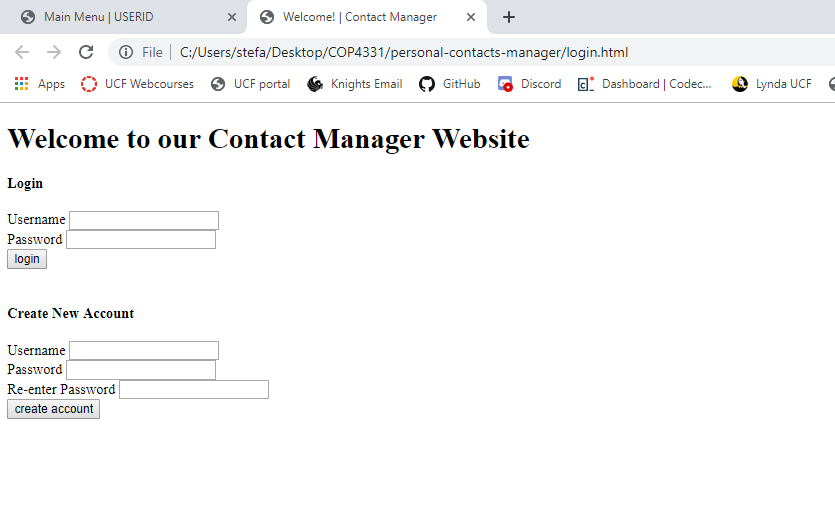
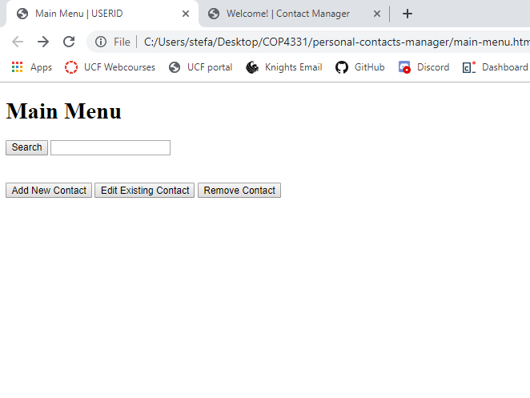
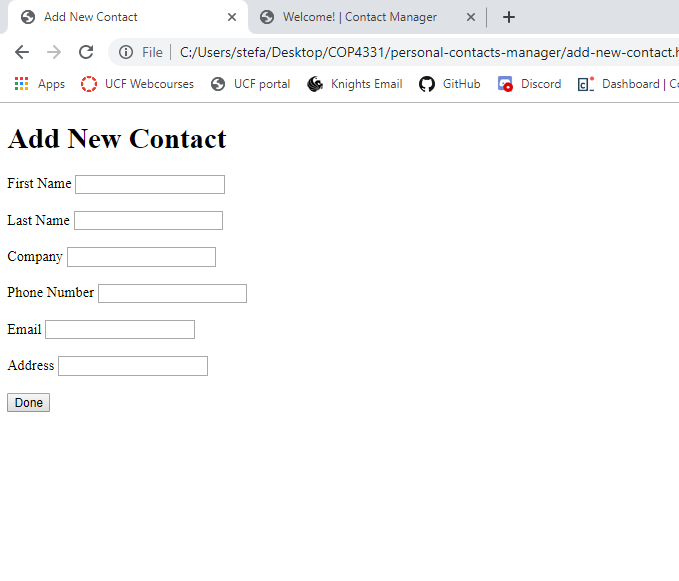
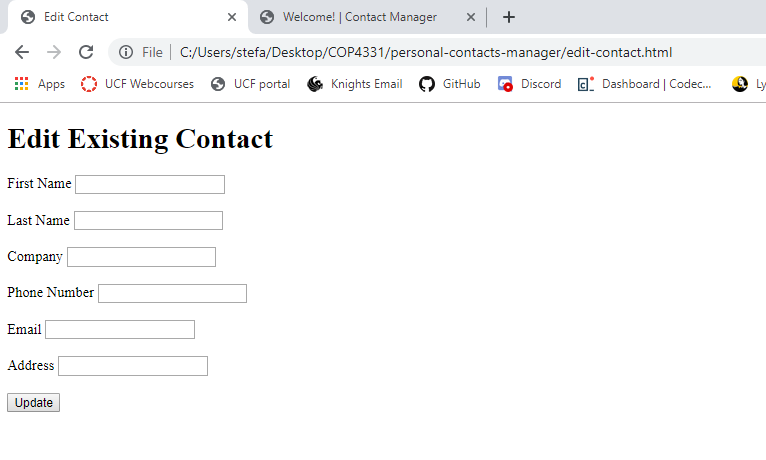
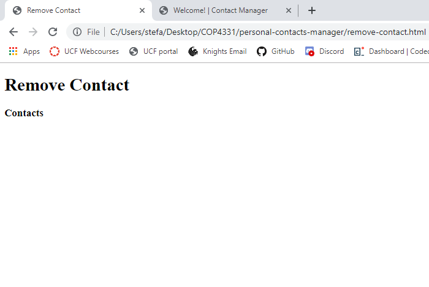

# personal-contacts-manager
This Web Client is going to allow the user to login or create a new account, search for contacts, update contacts, add new contacts, and remove contacts. This could be our master branch.

### Login Page
{:height = "50%" width = "50%"}

This page contains the login and create new contact form.

### Main Menu Page
{:height = "50%" width = "50%"}

Once the user is logged in, he/she can search, update, add, and delete contacts. There will be a search box and buttons that link to different pages.

### Add New Contact Page
{:height = "50%" width = "50%"}

A form for the user fill out a new contact's credentials(first and last name, company the new contact is affiliated with, phone number, email, and address).

### Edit Contact Page
{:height = "50%" width = "50%"}

A form that allows a user to make changes to a current contact.

### Remove Contact Page
{:height = "50%" width = "50%"}

This page is still a work in progress, but it should display list of all the contacts the user has. This information on this list will be from the database server.

NOTE: These webpages are still a work in progress and are not final.
